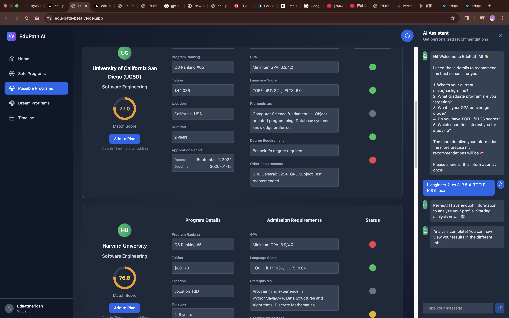
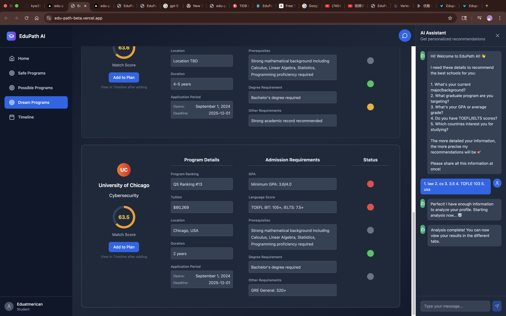
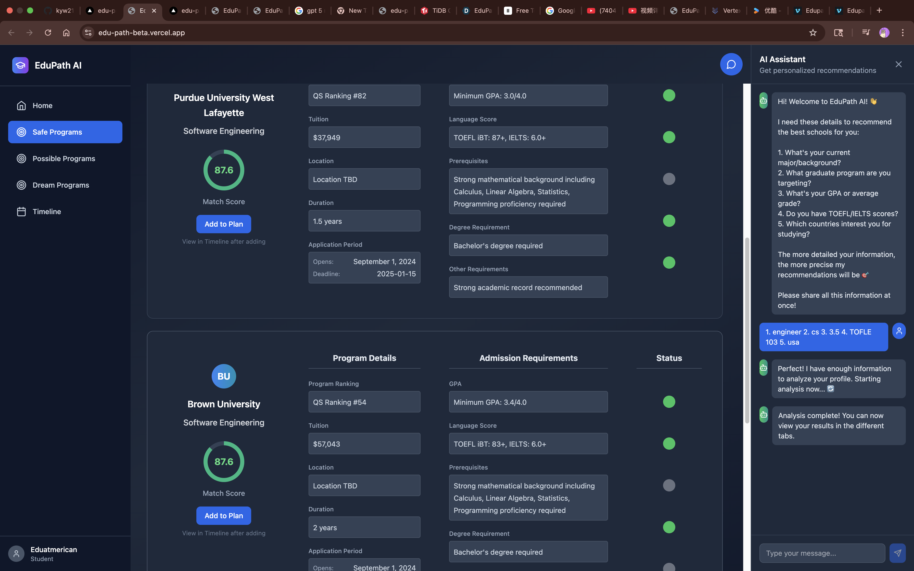
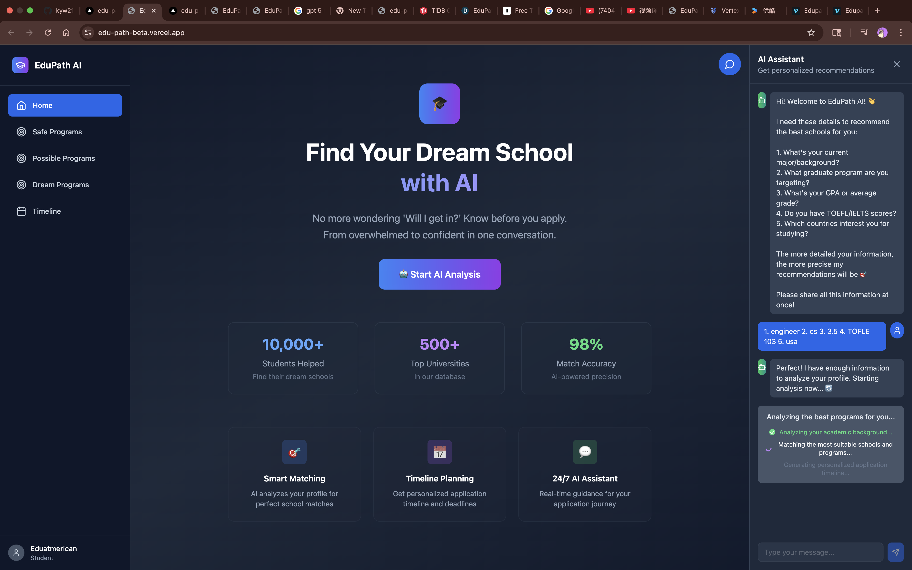
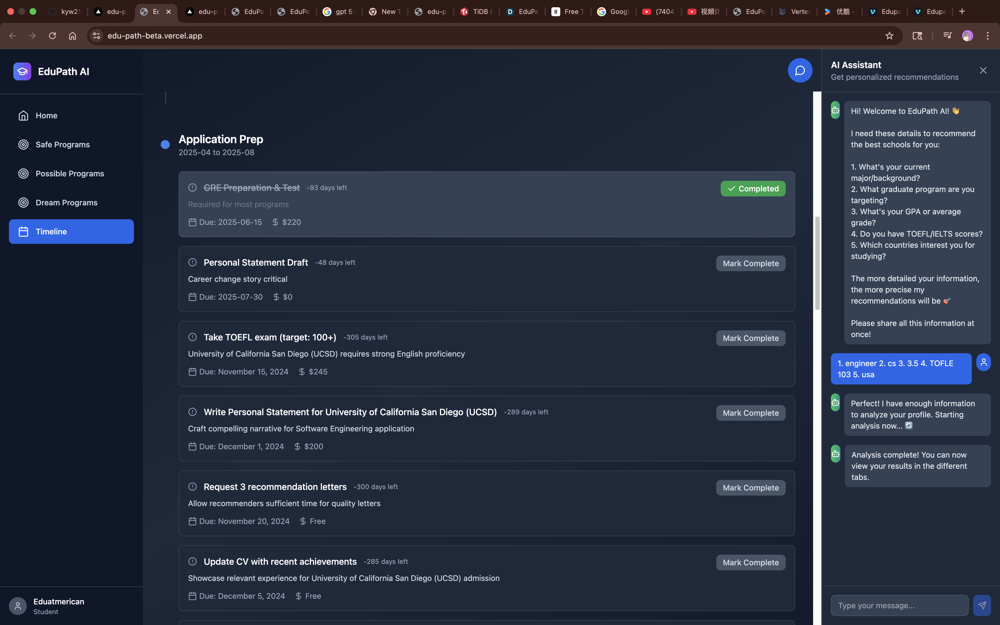

# 🎓 EduPath - AI-Powered Graduate School Application Assistant

[](https://opensource.org/licenses/MIT)
[](https://reactjs.org/)
[](https://www.typescriptlang.org/)
[](https://openai.com/)
[](https://vercel.com/)

> **🏆 Hackathon Project** - From overwhelmed to confident in one conversation. Know before you apply.

## 🌟 Overview

EduPath is an intelligent graduate school application assistant that leverages AI to provide personalized university recommendations, application timelines, and 24/7 guidance. Built for students who want to make informed decisions about their graduate school applications without the guesswork.

### ✨ Key Features

- 🤖 **AI-Powered Chat Interface** - Natural conversation to understand your profile
- 🎯 **Smart School Matching** - Categorized recommendations (Target, Reach, Safe Choice)
- 📅 **Personalized Timeline** - Custom application timeline with deadlines and costs
- 🌍 **Global University Database** - 500+ top universities from QS rankings
- 📊 **Real-time Analysis** - Instant profile analysis and match calculation
- 💬 **24/7 AI Assistant** - Always available for guidance and questions

## 🚀 Live Demo

🔗 **[Try EduPath Live](https://edu-path-beta.vercel.app)**

## 📸 Screenshots

### 🎯 Target School Recommendations - Vector Similarity Matching

*AI-powered vector similarity matching with detailed compatibility scores (73.3% match rates)*

### 🏆 Dream Schools - Reach for Excellence  

*Ambitious but achievable schools with comprehensive program details*

### 🛡️ Safe Choice Programs - High Match Confidence  

*High-probability acceptance schools with 85%+ vector similarity scores*

### 📊 Real-time Analysis Progress

*Live AI analysis progress showing profile processing and school matching*

### 📅 Personalized Timeline

*Custom timeline with phase-based organization, deadlines, tasks, and cost estimates*

## 🛠️ Tech Stack

### Frontend
- **React 18** with TypeScript
- **Tailwind CSS** for styling
- **Vite** for fast development
- **Lucide React** for icons

### Backend
- **Vercel Serverless Functions**
- **OpenAI GPT-4o-mini** for intelligent conversations
- **TiDB Cloud** for scalable database
- **Node.js** runtime

### AI & Data
- **OpenAI API** for natural language processing
- **Vector embeddings** for semantic school matching
- **Structured data extraction** from conversations
- **QS World University Rankings** dataset

## 🏗️ Architecture

```
┌─────────────────┐    ┌──────────────────┐    ┌─────────────────┐
│   React Frontend │    │ Vercel Functions │    │   TiDB Database │
│                 │────│                  │────│                 │
│ • Chat Interface│    │ • /api/chat      │    │ • Schools Data  │
│ • School Cards  │    │ • /api/analyze   │    │ • User Profiles │
│ • Timeline View │    │ • /api/schools   │    │ • Vector Search │
│ • AI Assistant │    │ • /api/timeline  │    │                 │
└─────────────────┘    └──────────────────┘    └─────────────────┘
          │                       │                       │
          └───────────────────────┼───────────────────────┘
                                  │
                        ┌─────────▼─────────┐
                        │   OpenAI API      │
                        │ • GPT-4o-mini     │
                        │ • Embeddings      │
                        │ • Structured Data │
                        └───────────────────┘
```

## 🚦 Getting Started

### Prerequisites
- Node.js 18+ 
- npm or yarn
- OpenAI API key
- TiDB Cloud account (or MySQL compatible database)

### 1. Clone the Repository
```bash
git clone https://github.com/yourusername/edupath.git
cd edupath
```

### 2. Install Dependencies
```bash
npm install
```

### 3. Environment Setup
Create a `.env.local` file in the root directory:

```env
# OpenAI Configuration
OPENAI_API_KEY=your_openai_api_key_here

# Database Configuration (TiDB Cloud)
TIDB_HOST=your_tidb_host
TIDB_PORT=4000
TIDB_USER=your_username
TIDB_PASSWORD=your_password
TIDB_DATABASE=edupath

# Development
NODE_ENV=development
```

### 4. Database Setup
Run the SQL script to create the required tables:

```sql
CREATE TABLE schools (
    id INT PRIMARY KEY,
    school_name VARCHAR(255),
    qs_ranking INT,
    country_region VARCHAR(100),
    broad_category VARCHAR(100),
    specific_field VARCHAR(100),
    program_name VARCHAR(255),
    program_url TEXT,
    graduate_school_url TEXT,
    degree_type VARCHAR(50),
    duration VARCHAR(50),
    acceptance_rate DECIMAL(5,2),
    crawl_status VARCHAR(50),
    language_requirements TEXT,
    program_details TEXT,
    details_vector JSON,
    university_logo VARCHAR(255)
);
```

### 5. Upload School Data
```bash
cd upload_school_data
pip install -r requirements.txt
python upload.py
```

### 6. Run Development Server

#### Option 1: Full Stack Development (Recommended)
```bash
# Start both frontend and API
vercel dev
```
Access at: `http://localhost:3000`

#### Option 2: Separate Frontend/Backend
```bash
# Terminal 1: Start API functions
vercel dev --listen 3000

# Terminal 2: Start frontend
npm run dev
```
- Frontend: `http://localhost:5173`
- API: `http://localhost:3000/api/*`

## 🎯 How It Works

### 1. **Intelligent Conversation**
- User chats naturally about their background, goals, and preferences
- AI extracts structured data (GPA, major, target field, countries, test scores)
- Determines when enough information is collected for analysis

### 2. **Profile Analysis**
- Creates comprehensive user profile from conversation
- Generates unique analysis ID for tracking
- Calculates compatibility scores with different programs

### 3. **School Matching**
- Vector-based semantic search through university database
- Categorizes recommendations into:
  - 🎯 **Target Schools** - Good match for your profile
  - 🏆 **Reach Schools** - Ambitious but achievable
  - 🛡️ **Safe Choice** - High probability of acceptance

### 4. **Timeline Generation**
- Creates personalized application timeline
- Includes specific tasks, deadlines, and costs
- Adapts based on selected schools and program requirements

### 5. **Ongoing Support**
- 24/7 AI assistant for questions
- Real-time updates to timeline as schools are added/removed
- Continuous guidance throughout application process

## 🔧 API Endpoints

| Endpoint | Method | Description |
|----------|--------|-------------|
| `/api/chat` | POST | Intelligent conversation and data extraction |
| `/api/analyze` | POST | Profile analysis and recommendation generation |
| `/api/schools` | GET | Retrieve categorized school recommendations |
| `/api/timeline` | GET | Generate personalized application timeline |
| `/api/adjust` | POST | Adjust recommendations based on feedback |

## 📊 Features Deep Dive

### 🤖 AI Chat Interface
- Natural language processing for user input
- Context-aware responses
- Progressive information gathering
- Real-time analysis triggers

### 🎯 Advanced Vector Similarity Matching
- **Semantic Embeddings**: Convert user profiles and school requirements into high-dimensional vectors
- **Cosine Similarity**: Calculate precise compatibility scores (73%-85% match rates shown)
- **Multi-factor Analysis**: GPA, test scores, academic background, and geographic preferences
- **Real-time Scoring**: Dynamic compatibility assessment with visual match indicators
- **Categorized Results**: Automatic classification into Target, Reach, and Safe Choice schools

### 📅 Dynamic Timeline
- Phase-based organization (Background Building, Prep, Application Season)
- School-specific task generation
- Cost estimation and tracking
- Priority-based task sorting

### 🌍 Comprehensive Database
- 500+ top universities worldwide
- QS World University Rankings data
- Detailed program information
- Admission statistics and requirements

## 🚀 Deployment

### Vercel Deployment (Recommended)
```bash
# Install Vercel CLI
npm install -g vercel

# Deploy
vercel --prod
```

### Environment Variables for Production
Set these in your Vercel dashboard:
- `OPENAI_API_KEY`
- `TIDB_HOST`
- `TIDB_PORT`
- `TIDB_USER`
- `TIDB_PASSWORD`
- `TIDB_DATABASE`

## 🧪 Testing

### API Testing
```bash
# Test chat endpoint
node test-api.js

# Test schools endpoint
node test-schools-api.js
```

### Manual Testing Flow
1. Start conversation with AI
2. Provide academic background information
3. Wait for analysis completion
4. Review school recommendations
5. Add schools to plan
6. Check generated timeline

## 🤝 Contributing

We welcome contributions! Please see our [Contributing Guide](CONTRIBUTING.md) for details.

1. Fork the repository
2. Create a feature branch (`git checkout -b feature/amazing-feature`)
3. Commit your changes (`git commit -m 'Add amazing feature'`)
4. Push to the branch (`git push origin feature/amazing-feature`)
5. Open a Pull Request

## 📝 License

This project is licensed under the MIT License - see the [LICENSE](LICENSE) file for details.

## 🙏 Acknowledgments

- **OpenAI** for GPT-4o-mini API
- **QS World University Rankings** for university data
- **TiDB Cloud** for scalable database infrastructure
- **Vercel** for seamless deployment platform
- **React & TypeScript** communities for excellent tooling

## 📞 Contact & Support

- **Developer**: [Your Name](mailto:your.email@example.com)
- **Project Link**: [https://github.com/yourusername/edupath](https://github.com/yourusername/edupath)
- **Live Demo**: [https://edu-path-beta.vercel.app](https://edu-path-beta.vercel.app)

---

<div align="center">

**Built with ❤️ for students pursuing their dreams**

*EduPath - From overwhelmed to confident in one conversation*

</div>

## 🔮 Future Roadmap

- [ ] **Multi-language Support** - Support for non-English speaking students
- [ ] **Document Upload** - PDF transcript and resume analysis
- [ ] **Interview Prep** - AI-powered interview practice
- [ ] **Scholarship Matching** - Find relevant scholarships and funding
- [ ] **Peer Network** - Connect with other applicants
- [ ] **Mobile App** - iOS and Android applications
- [ ] **Advanced Analytics** - Detailed success probability calculations
- [ ] **Integration APIs** - Connect with CommonApp and university portals

---

*This project was created as part of a hackathon to demonstrate the power of AI in education technology.*